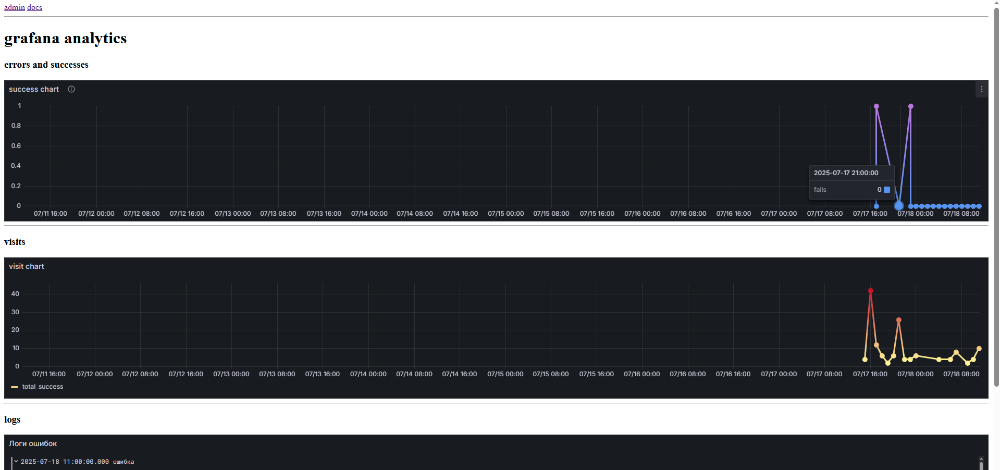
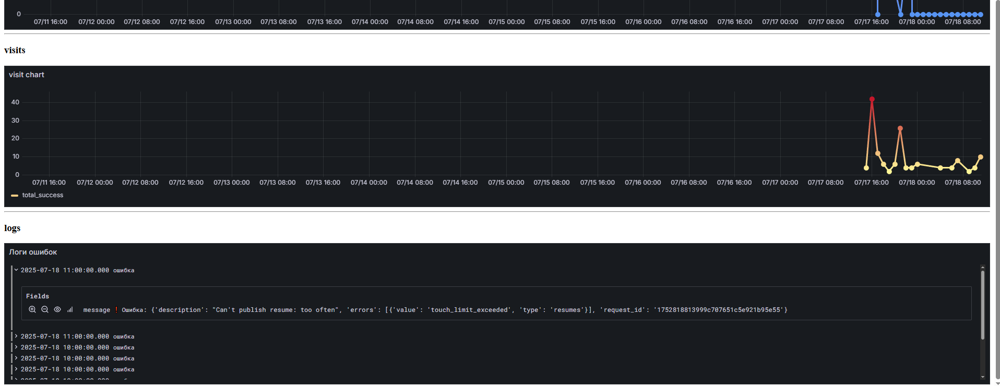

# мини аналитика в графане
сервис -- мини пример аналитики в графане.
`python push_message.py <message>` -- утилита для баш скриптов которая пушит сообщение и код в бд.
бд необходимо переместить в домашнюю директорию, так как самый популярный фреймворк для аналитики не умеет читать из рута.

вообще лучше использовать не sqlite, т.к. для нее нужен отдельный плагин.

## пример работы



стек: fastapi, sqlite, graphana, cron, bash

query для дашбордов:

1
```sql
WITH converted AS (
   SELECT success, message, timestamp AS datetime FROM maindata
   WHERE message <> 'visit'
)
SELECT 
    success as fails,
    strftime('%Y-%m-%dT%H:00:00Z', datetime) AS time
FROM converted 
ORDER BY time ASC
```

2
```sql
WITH converted AS (
   SELECT success, message, timestamp AS datetime FROM maindata
   WHERE message = 'visit'
)
SELECT 
    SUM(success) as total_success,
    strftime('%Y-%m-%dT%H:00:00Z', datetime) AS time
FROM converted 
GROUP BY strftime('%Y-%m-%d %H', datetime)
ORDER BY time ASC
```

3
```sql
SELECT id, strftime('%Y-%m-%dT%H:00:00Z', timestamp) AS time, CASE 
        WHEN INSTR(message, 'Обновлено') > 0 THEN 'успех'
        ELSE 'ошибка'
    END  as TitleMessage, message FROM maindata WHERE message <> "visit" ORDER BY id DESC LIMIT 50;
```